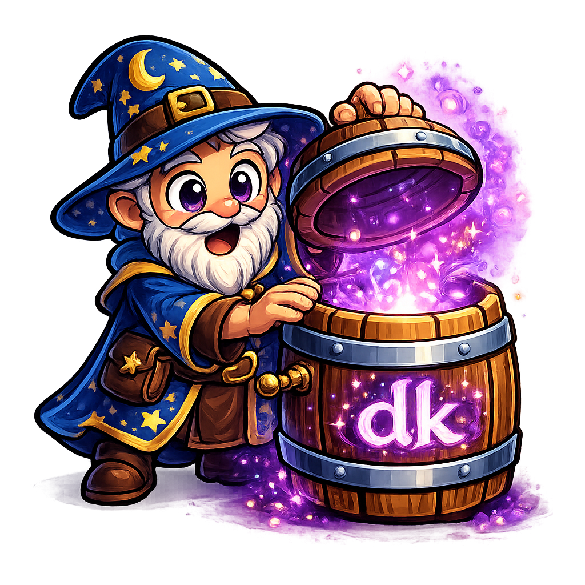

<div align="center">
  
</div>

<h1 align="center">datakeg</h1>

<p align="center">
  A command-line tool that generates synthetic training data from raw documentation.
</p>

<div align="center">

[](https://github.com/danmurf/datakeg/actions/workflows/ci.yml)
[](https://github.com/danmurf/datakeg/blob/main/LICENSE)

</div>

## Overview

datakeg processes markdown and text files from a source directory, generates question-answer pairs using LLM providers, and outputs structured JSONL files ready for training, validation, and testing. Generated data can then be converted into model-specific training formats using built-in or custom templates.

## Inference Costs

**You are responsible for all inference costs incurred while using this tool.**

This tool makes calls to LLM models to generate training data. Depending on your setup and model selection, this may result in costs including but not limited to:
- API or usage fees from your LLM provider
- Computational costs from model inference
- Token-based charges from commercial models

Review your configuration and model choices before running datakeg. The tool itself is free, but the models it invokes may not be. Use responsibly and monitor your usage.

## Features

- Process markdown (`.md`) and text (`.txt`) files automatically
- Multiple LLM providers: local [Ollama](https://ollama.ai/) or cloud [OpenRouter](https://openrouter.ai/)
- Three output formats: completion (prompt/completion), chat (multi-turn messages), and reasoning (chain-of-thought)
- Automatic train/validation/test split generation with cross-split deduplication and exclusion
- Per-document output files with optional merge step
- Convert generated JSONL into model-specific training formats (Mistral Instruct, Llama 3, ChatML, DeepSeek-R1)
- Custom conversion templates for any model format
- Configurable pair density, split percentages, and timeouts
- Cost estimation with `--dry-run` for cloud providers

## Prerequisites

- Go 1.25.4 or later
- [Ollama](https://ollama.ai/) running locally (for the default `ollama` provider)
- An Ollama model downloaded (default: `gpt-oss:20b`)

For cloud providers, you'll also need:
- An [OpenRouter](https://openrouter.ai/) API key (for the `openrouter` provider)

## Installation

```bash
go build -o datakeg ./cmd/datakeg
```

Or install to your `$GOPATH/bin`:

```bash
make install
```

## Quick Start

```bash
# Generate synthetic training data from documentation
datakeg generate ./docs ./output

# Generate chat-format training data
datakeg generate --format chat ./docs ./output

# Convert to Mistral Instruct format
datakeg convert --template mistral-instruct ./output/train.jsonl ./output/train_mistral.jsonl
```

## Commands

### generate

Generate train/valid/test datasets from documentation files.

```bash
datakeg generate [flags] <source> <output>
```

**Flags:**

| Flag | Description | Default |
|------|-------------|---------|
| `-f, --format` | Output format: `completion`, `chat`, `reasoning` | `completion` |
| `--reasoning-format` | Reasoning variant: `separate` or `integrated` | `separate` |
| `--system-message` | System message for chat format output | |
| `--pairs-per-1k` | Target pairs per 1000 characters | `10` |
| `--train-pct` | Training set percentage (0.0-1.0) | `0.6` |
| `--valid-pct` | Validation set percentage (0.0-1.0) | `0.2` |
| `--test-pct` | Test set percentage (0.0-1.0) | `0.2` |
| `--skip-merge` | Output per-document files only, skip merge | `false` |
| `-t, --timeout` | Per-document timeout in minutes | `60` |
| `--dry-run` | Print cost estimate and exit (cloud providers) | `false` |
| `-y, --yes` | Skip confirmation prompts | `false` |

**Global flags (available on all commands):**

| Flag | Description | Default |
|------|-------------|---------|
| `-m, --model` | Model to use (provider-specific) | `gpt-oss:20b` |
| `--provider` | LLM provider: `ollama`, `openrouter` | `ollama` |

**Examples:**

```bash
# Basic generation with Ollama
datakeg generate ./docs ./output

# Chat format with a system message
datakeg generate --format chat --system-message "You are a helpful assistant." ./docs ./output

# Reasoning format (chain-of-thought)
datakeg generate --format reasoning ./docs ./output

# Reasoning with integrated output (prompt/completion instead of separate fields)
datakeg generate --format reasoning --reasoning-format integrated ./docs ./output

# Using OpenRouter with a specific model
datakeg generate --provider openrouter --model anthropic/claude-sonnet-4-5-20250929 ./docs ./output

# Per-document files without merging
datakeg generate --skip-merge ./docs ./output

# Cost estimate only
datakeg generate --provider openrouter --dry-run ./docs ./output
```

### convert

Convert generated JSONL files into model-specific training formats using built-in or custom templates. Source format (completion, chat, reasoning) is auto-detected from the JSONL structure.

```bash
datakeg convert [flags] <input.jsonl> <output.jsonl>
```

**Flags:**

| Flag | Description |
|------|-------------|
| `-t, --template` | Built-in conversion template name |
| `--custom-template` | Path to a custom conversion template file |
| `--source-format` | Override auto-detection: `completion`, `chat`, `reasoning` |
| `-l, --list-templates` | List available built-in templates |

**Built-in templates:**

| Template | Source Format | Description |
|----------|--------------|-------------|
| `mistral-instruct` | completion | Mistral Instruct format with `[INST]` tags |
| `llama3-instruct` | chat | Llama 3 Instruct with header tags |
| `chatml` | chat | ChatML format with `<\|im_start\|>` tags |
| `deepseek-r1` | reasoning | DeepSeek-R1 integrated reasoning format |

**Examples:**

```bash
# Convert completion data to Mistral Instruct format
datakeg convert --template mistral-instruct train.jsonl train_mistral.jsonl

# Convert chat data to ChatML format
datakeg convert --template chatml train.jsonl train_chatml.jsonl

# Use a custom template
datakeg convert --custom-template my-format.tmpl train.jsonl train_custom.jsonl

# List available templates
datakeg convert --list-templates
```

**Custom templates** use Go's [text/template](https://pkg.go.dev/text/template) syntax. A `jsonEscape` function is available for safely embedding field values in JSON strings. Template input depends on the source format:

- **completion**: `.Prompt`, `.Completion`
- **chat**: `.Messages` (array of `.Role`, `.Content`)
- **reasoning**: `.Question`, `.Reasoning`, `.Answer`

Example custom template for completion data:

```
{"text": "### Question\n{{.Prompt | jsonEscape}}\n### Answer\n{{.Completion | jsonEscape}}"}
```

### merge

Merge per-document JSONL files (generated with `--skip-merge`) into master train/valid/test files.

```bash
datakeg merge <output>
```

### list-providers

Show available LLM providers and their configuration status.

```bash
datakeg list-providers
```

### version

Print version information.

```bash
datakeg version
```

## Output Formats

### Completion (default)

Standard prompt/completion pairs:

```json
{"prompt": "What is...", "completion": "The answer is..."}
```

### Chat

Multi-turn conversation format with roles:

```json
{"messages": [{"role": "user", "content": "What is..."}, {"role": "assistant", "content": "The answer is..."}]}
```

### Reasoning

Chain-of-thought format. The `separate` variant (default) uses distinct fields:

```json
{"question": "What is...", "reasoning": "<think>Step 1...</think>", "answer": "The answer is..."}
```

The `integrated` variant combines reasoning into the completion:

```json
{"prompt": "What is...", "completion": "<think>Step 1...</think>\n\nThe answer is..."}
```

## License

See LICENSE file for details.
